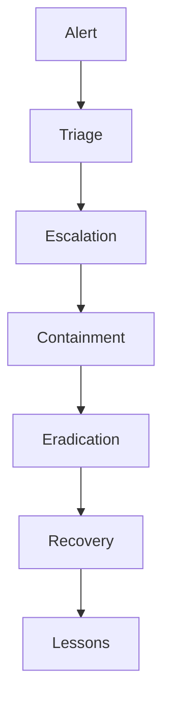
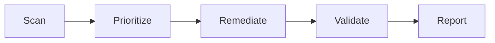

# -Cybersecurity-Portfolio
## 🔐 Overview
This repository contains automation scripts and workflows for SOC operations, log parsing, and incident response.  
Aligned with my professional experience in **SIEM (Splunk, Microsoft Sentinel)**, **EDR (CrowdStrike)**, and **vulnerability management (Qualys, Nessus)**.

# SOC Automation Scripts

[](ca://s?q=Add_build_status_badge_to_GitHub_repo)
[](ca://s?q=Add_security_scan_badge_to_GitHub_repo)
[](ca://s?q=Add_license_badge_to_GitHub_repo)
[](ca://s?q=Add_programming_language_badge_to_GitHub_repo)

---
```
##📂 Repository Structure
```text
/scripts
    log_parser.py
    vuln_validation.ps1
/playbooks
    mitre_attack_mapping.md
/docs
    incident_response_template.md
    ```

### 🚀 *Getting Started*
### Clone the repo
- Install dependencies (pip install -r requirements.txt)
- Run scripts with sample log files in /data
- Review Mermaid diagrams in README for workflow context

### 🔮 *Future Work*
- Splunk detection queries
- AWS GuardDuty automation scripts
- Compliance audit dashboards
----
## 📜 License
MIT License — free to use and adapt with attribution.
```
## 🌐 Connect with Me

[](https://github.com/ennduka86-spec)
[](https://www.linkedin.com/in/ejikeme-nduka-06633a66/)
[](mailto:ennduka86@gmail.com)


---

## ⚙️ Features
- Automated log parsing for high‑volume SOC alerts  
- MITRE ATT&CK technique mapping for detection rules  
- Cloud security posture checks (AWS GuardDuty, Azure Defender)  
- Vulnerability remediation validation scripts  
```

## 📊 Workflow Diagram (Mermaid)

### Incident Response Lifecycle

### Vulnerability Management Flow


